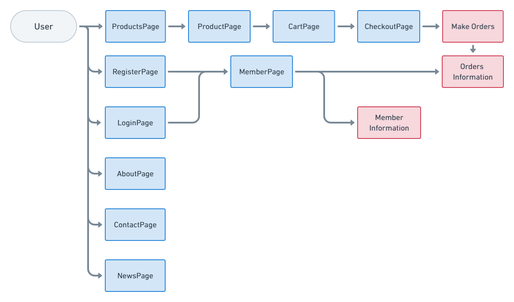
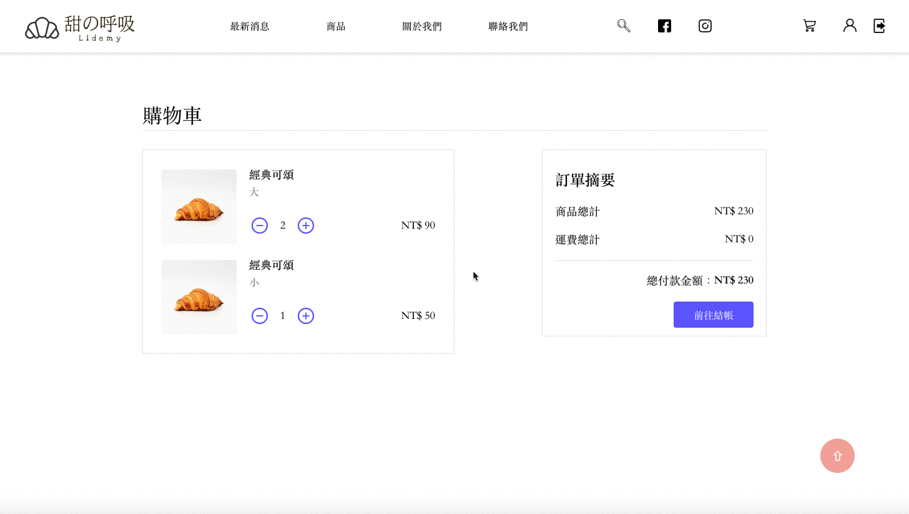
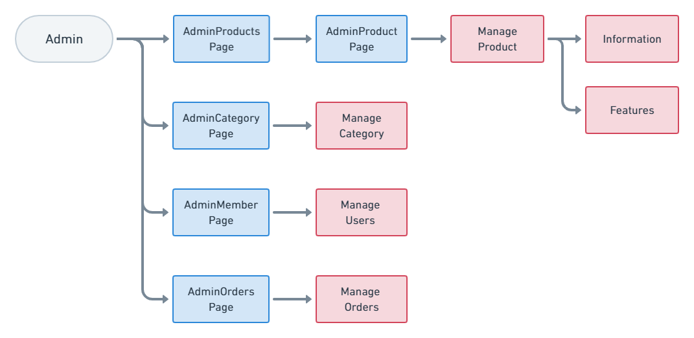
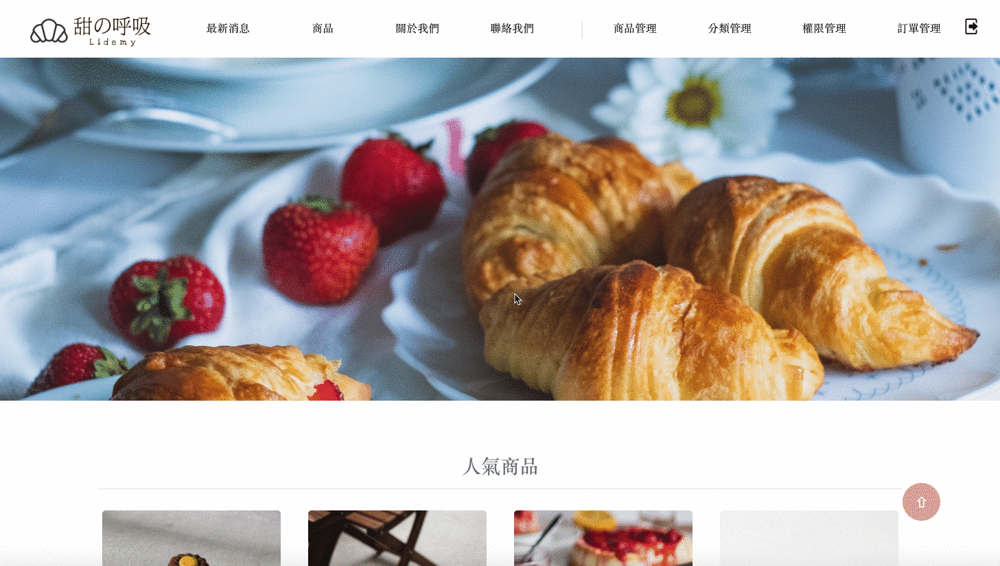
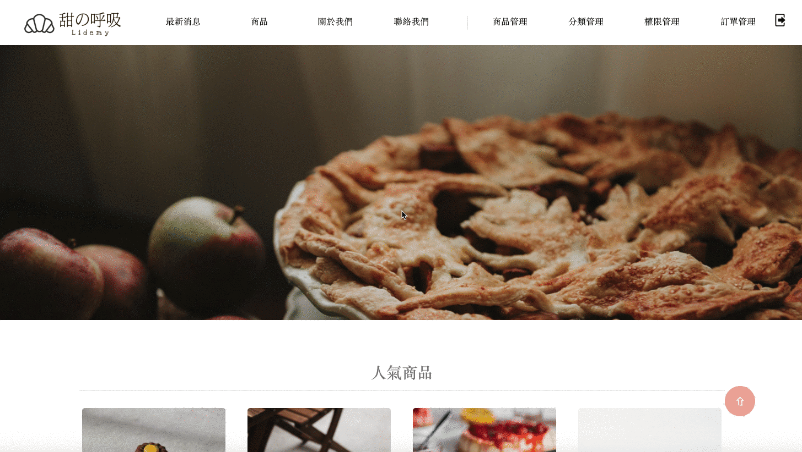
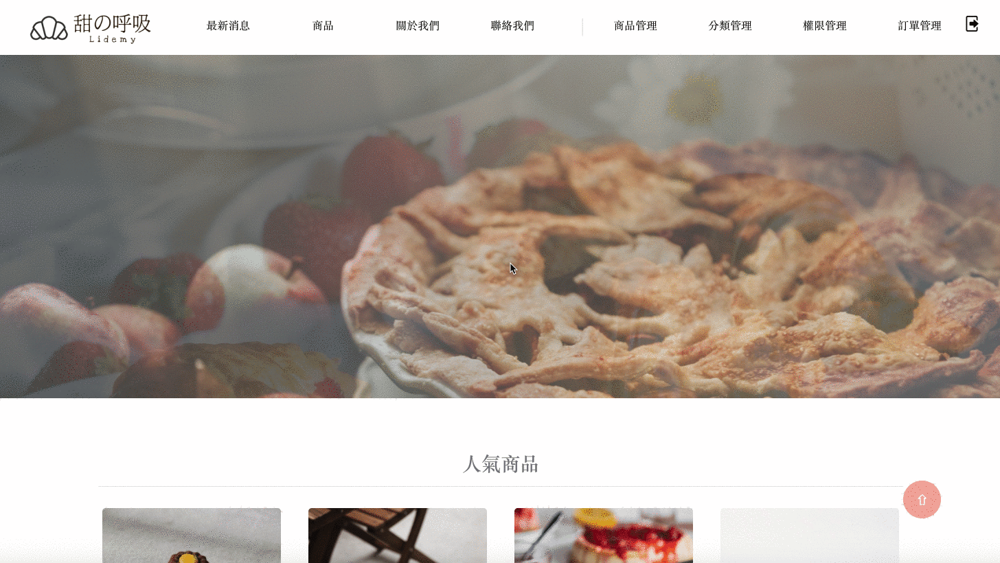

# Sweet Breath 甜の呼吸 - 網路甜點工作室

[網站 DEMO](https://ivymuchacha.github.io/sweetBreath-frontend/#/)

| 測試用身份 | 帳號  | 密碼  |
| ---------- | ----- | ----- |
| 管理員     | admin | admin |
| 會員       | QQQ   | QQQ   |

## 專案介紹

本專案為「Sweet Breath 甜の呼吸 - 網路甜點工作室」前端原始碼，採用前端技術 React Hooks，搭配後端技術 Express、Sequelize 進行開發。

## 專案展示

### 使用者相關功能

#### `頁面架構`

#### `產品模組`

- 瀏覽所有產品：可依照分類檢視產品。
- 瀏覽單一產品：可瀏覽產品詳細資訊、規格、庫存，並可選擇產品數量加入購物車。

#### `購物模組`

- 購物車系統：顯示加入購物車產品，並顯示訂單摘要。
- 結帳功能：導向登入頁面，登入後輸入配送資料，確認訂單資訊、總額後，即可建立訂單。

#### `會員模組`

- 會員註冊：輸入並符合欄位格式，即可註冊成功。
- 會員登入：輸入帳號、密碼，即可登入。
- 會員身分驗證：登入後依會員權限顯示一般權限選單／管理權限選單。
- 會員專區：會員登入後可瀏覽或編輯個人資料、檢視消費紀錄。

#### `基本模組`

- 首頁：主打活動輪播區、顯示人氣產品。
- 關於我們：瀏覽網站架設理念。
- 最新消息：瀏覽最新消息列表。
- 聯絡我們：瀏覽店家相關聯絡資訊、Google Maps 實體地址。

#### 管理者相關功能

#### `頁面架構`

#### `分類管理模組`

- 依照分類管理：可新增或編輯產品分類。

#### `產品管理模組`

- 依照規格管理：可新增或編輯產品資訊、產品規格。

#### `權限管理模組`

- 會員搜尋功能：可瀏覽所有帳號，依照使用者 id 或名稱搜尋特定帳號。
- 會員管理功能：可變更會員權限狀態，分為一般權限、管理權限、停權。

#### `訂單管理模組`

- 瀏覽所有訂單：可查看所有訂單明細，並依照訂單狀態顯示訂單進度。
- 訂單管理功能：可依照付款進度、出貨進度調整訂單狀態，或取消處理中訂單。

## 專案執行

1. 執行 `npm install` 安裝專案所需套件。

2. 執行 `npm run start`，在 http://localhost:8080 啟動專案。

3. 執行 `npm run build`，在 dist 資料夾建立專案 production 版本。

## 專案前端技術

#### `框架`

- [React Hooks](https://reactjs.org/)
- [React DOM](https://www.npmjs.com/package/react-dom)

#### `第三方套件`

- [React Router DOM](https://reactrouter.com/)：使用內建 HashRouter 建立路由
- [styled-components](https://styled-components.com/)：使用 JSX 語法撰寫 CSS 樣式
- [PropTypes](https://www.npmjs.com/package/prop-types)：型別檢查
- [ESLint](https://eslint.org/)：檢查語法，統一程式撰寫風格
- [Prettier](https://prettier.io/)：統一程式碼格式
- [Google Map React](https://github.com/google-map-react/google-map-react)：串接 Google Cloud Platform
- [gh-pages](https://create-react-app.dev/docs/deployment/)：官方推薦的快速部署方法
- [bootstrap](https://getbootstrap.com/)：套用部分樣式
- [react-slick](https://react-slick.neostack.com/)：圖片輪播功能
- [react-spinners](https://www.npmjs.com/package/react-spinners)：讀取資料時套用特效
- [http-proxy-middleware](https://www.npmjs.com/package/http-proxy-middleware)：避免每次串接 API 必須帶入一串網址

#### `第三方 API`

- [Google Cloud Platform](https://cloud.google.com/)

## 專案後端技術

「Sweet Breath 甜の呼吸 - 網路甜點工作室」後端原始碼，採用 Express、Sequelize 開發，生成 API 與前端串連。

- 專案連結：[sweetbreath-backend](https://github.com/ivymuchacha/sweetBreath-backend)

## Resource - 資料引用來源

[unsplash](https://unsplash.com/)

## Declaration - 聲明

本作品內圖片、內容等，純粹為個人練習前端使用，不做任何商業用途。

## 專案授權

[MIT License](https://choosealicense.com/licenses/mit/)
